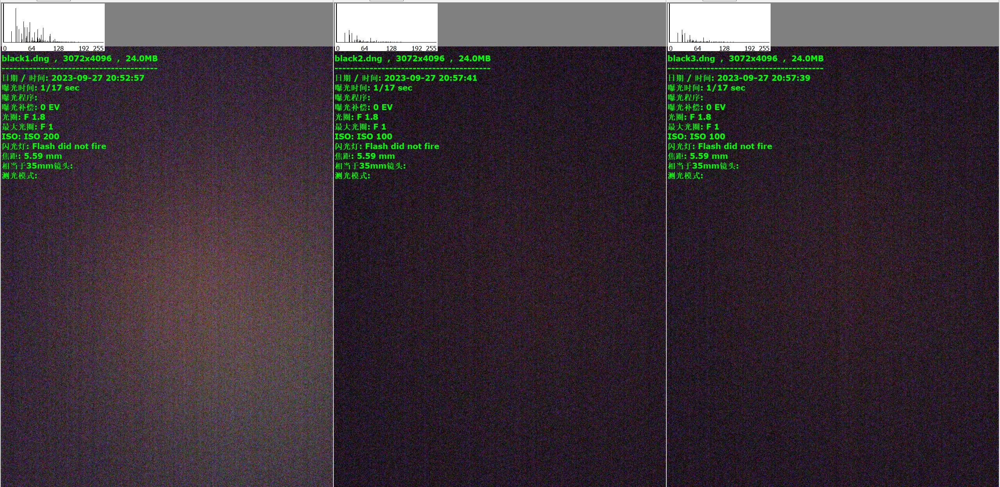
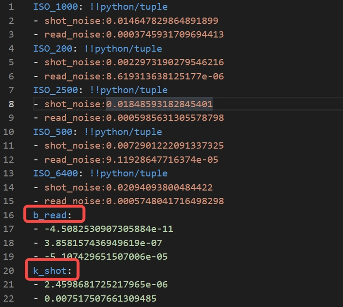

# AI_NR:  2D AI-Noise Reduction for RAW Images

## 介绍
这是一个关于AI_ISP模块：Noise Reduction 的工程文档，针对目标camera如（sensor：IMX766）梳理AI降噪的工程实现流程，该项目包含：数据准备、模型设计、模型训练、模型压缩、模型推理等。请先确保安装该项目的依赖项，通过git clone下载该项目，然后在该项目的根目录下执行以下命令安装依赖项。

```shell
git clone
cd AI_ISP/Denoise
pip install -r requirements.txt

```
## 0. 项目结构
```shell
├── assets
├── IMX766
|   ├── black_img
|   ├── calibrate_img
|   ├── test_data
|   ├── train_data
├── infer_model
|   ├── inference.py
|   ├── infer_config.yaml
├── train_model
|   ├── training
|       ├── tensorboard
|       ├── log
|       ├── checkpoints
|   ├── run.sh
|   ├── train_config.yaml
|   ├── train.py
|   ├── make_dataloader.py
├── utils
|   ├── tools.py
|   ├── make_dataset.py
|   ├── noise_profile.py
├── demo.py

```

## 1. 数据准备
AI降噪模型开发的第一步也是非常重要的一步，数据采集，训练数据分布与推理场景有较大的域差异则会显著降低降噪表现。
以监督学习为例，监督学习需要成对的数据，即有噪声的图像和无噪声的图像，可以通过以下方式获得。

#### 1.1 Camera实拍成对数据
实拍数据可来源于开源数据集，其提供了camera实拍成对的匹配数据，GT可以通过静止多帧平均、低ISO等方式得到，以下是一些开源数据集。

 |Dataset| URL  |Domain|  
 |:-----:|:-------:|:--:|
 |DND|[url](https://noise.visinf.tu-darmstadt.de/)                         |RAW   |
 |SID|[url](https://pan.baidu.com/s/1fk8EibhBe_M1qG0ax9LQZA#list/path=%2F) |RAW |
 |SIDD|[url](https://www.eecs.yorku.ca/~kamel/sidd/dataset.php)            |RAW+RGB    |                      
 |Renoir|[url](http://ani.stat.fsu.edu/~abarbu/Renoir.html)                |RAW    |
 |MIT-Adobe FiveK|[url](https://data.csail.mit.edu/graphics/fivek/)        |RAW+RGB    |
    
> *优点：实拍数据与推理场景的域差异较小，因此不需要进行数据增强，以及噪声标定，可以直接用于训练。* <br>
> *缺点：数据集camera的噪声分布与推理场景有较大的域差异，通常不能直接应用于不同的camera，需要进一步处理，且拍摄负担较大。* <br>
> *Tips：实拍开源数据集可以作为benchmark来测试AI model的降噪表现，但一般不直接用于训练集的构建。*

#### 1.2 依据噪声模型合成匹配数据
这里是一些关于RAW-domain噪声模型的开源项目，你可以从这些介绍中了解更多关于噪声模型的知识。

 | Paper| Code|Noise Model |Year&lab|
 |:----:|:----:|:-------:|:-------:|
 |UPI|[code](https://github.com/timothybrooks/unprocessing)|   P + G      |CVPR 2019|
 |PMRID|[code](https://github.com/MegEngine/PMRID)       |   P’ + G     |ECCV 2020|
 |ELD|[code](https://github.com/Vandermode/ELD)|  P’ + TL |CVPR 2021|
 |Rethinking|[code](https://github.com/zhangyi-3/Noise-Synthesis) | P’ + Sample|ECCV 2022|

> *优点：可以根据噪声模型合成任意数量的数据，可以用于训练。* <br>
> *缺点：需要标定噪声模型，不合理的噪声模型直接导致降噪模型的表现不佳。* <br>
> *Tips：应用ELD等先进的噪声模型可以提高极暗光（<1lux）场景下的信噪比和清晰度，本文不详细讨论不同噪声模型的优劣。*

#### 1.3 噪声标定
噪声标定是指针对目标camera采集基准帧，计算均值方差等数据属性来拟合噪声分布，从而得到目标camera噪声模型的参数。本章采用一种普遍的RAW domain噪声模型，即Poisson-Gaussian噪声模型，具体操作如下。<br>

- ##### 采集一组基准黑帧

> * 针对目标camera：手机摄像头realme-大师探索GT（sensor：IMX766），采集一组基准黑帧，如下图所示。
> * 在暗室内将摄像头盖住避免进光照射，采集camera直出的RAW，其求均值得到黑电平。
> * 采集的黑帧数量越多，平均后得到的黑电平越准确，通常可以将黑帧数量设置为5，本次实验为3。

- ##### 采集一组灰度帧

> * 准备灰度卡，调整不同ISO进行拍摄，得到一组灰度帧，如上图所示。
> * 采集的灰度帧数量越多，噪声分布越准确，通常可以采集5组不同ISO（如500~6400）档位。
> * 需要确保不同ISO下的灰度帧数量相同，否则会导致噪声分布不准确。
> * 适当调整环境光照和曝光，避免环境光照的变化导致灰度帧的曝光不一致。

- ##### 标定参数
  1. 通过基准黑帧得到黑电平，对拍摄到的灰度帧应用黑电平得到归一化的RAW。
  2. 标定灰度帧的ROI区域，并且记录该区域的详细坐标，作为噪声分布的采样区域，如下图红框所示。
      
  3. 不同ISO下的ROI均值作横轴，方差作纵轴，拟合一次函数得到斜率和截距，得到Poisson-Gaussian噪声模型中参数k和sigma，如下图所示。
      
  4. 拟合ISO和k及ISO和sigma的关系，得到噪声模型的参数配置文件。
  5. 通过噪声模型参数配置文件，可以得到任意ISO下的噪声模型参数，从而可以合成匹配数据，该部分的code可参考[./utils/noise_profile.py](utils/noise_profile.py)。
  6. 由于已提前进行上述帧采集操作，通过运行以下code来直接生成配置文件。

     ```python
     python utils/noise_profile.py 
     ```
     运行code后生成如下yaml文件，即为噪声模型的参数配置文件。
      

#### 1.4 合成匹配数据
成对的匹配数据需要标签图和输入图，首先需要对标签图进行采集。
- ##### 采集标签图
  标签图即干净的RAW图，可以通过以下方式获得：
    - 用目标camera采集一组低ISO、长曝光的RAW图，如ISO100，曝光时间为1s。
    - 用目标camera采集一组静止多帧的RAW图，如ISO100，曝光时间为1/10s，采集帧数为100，通过求平均得到干净的RAW图。
    - 用开源数据集中的GT作标签，但需要对一些脏数据做一些传统滤波处理，本文采取该方式进行标签图像采集（已附带5张4k的GT-RAW作为参考，位于`./train_data/gt_img`目录下）。

- ##### 应用噪声模型
应用噪声模型时需注意ISO是可调的超参，尽可能广泛选取大范围的ISO来模拟高动态的噪声分布（如ISO100~6400）。


> * 本实验选取ISO1000~6400来对每个patch加噪声得到与目标camera噪声分布匹配的带噪图，如图所示。 
> * 加噪声需要经过一些归一化、pack等操作，该部分code可参考[./utils/tools.py](utils/tools.py)。

- ##### 制作训练集和验证集
为了加速训练集的数据读取以提高训练效率，本实验采用LMDB格式存储数据，通过运行以下code，可以将数据集转换为LMDB格式。

```python
python utils/make_dataset.py
```
> * 运行code后生成如下LMDB文件，即为训练集的LMDB文件，位于`./train_data/.mdb`下。
> * 运行code后同时生成训练集和验证集的ID文件，位于`./train_data/valid_data_idx.txt`下。
> * 训练时，通过ID文件读取训练集LMDB和验证集的数据。

## 2. 模型设计
本节介绍AI model的选择和设计方式，将model作为噪声分布拟合器来实现噪声的预测和去除。

#### 2.1 开源模型
AI降噪模型来源可以通过历年的NTIRE竞赛或者图像视觉会议（如CVPR、ECCV、AAAI等）获得，这里列举了一些开源的优秀降噪（或可适用于降噪）模型，部分code位于` ./model_zoo/`下。

 |Model|Paper                                                                             | Code                                                | Year & lab|Domain|
 |:----|:--------------------------------------------------------------------------------:|:---------------------------------------------------:|:---------:|:----:|
 |DnCNN|[paper](https://arxiv.org/pdf/1608.03981.pdf)                                     |[code](https://github.com/cszn/DnCNN)                |CVPR2017|RGB|
 |PMRID|[paper](https://www.ecva.net/papers/eccv_2020/papers_ECCV/papers/123510001.pdf)   |[code](https://github.com/MegEngine/PMRID )          |旷视 ECCV 2020 |RAW|
 |MPRNet|[paper](https://arxiv.org/abs/2102.02808.pdf)                                    |[code](https://github.com/swz30/MPRNet)              |UAE CVPR 2021|RGB|
 |Unprocessing|[paper](https://arxiv.org/abs/1811.11127)                                  |[code](https://github.com/timothybrooks/unprocessing)|Google CVPR 2019|RAW|
 |FFDNet|[paper](https://arxiv.org/abs/1710.04026)                                        |[code](https://github.com/cszn/FFDNet)               |NTIRE2018|RGB|
 |RIDNet|[paper](https://arxiv.org/abs/1904.07396)                                        |[code](https://github.com/saeed-anwar/RIDNet)        |NTIRE2019|RGB|
 |CycleISP|[paper](https://arxiv.org/abs/2003.07761)|[code](https://github.com/swz30/CycleISP)|UAE CVPR 2020|RAW|
 |GRDN|[paper](https://arxiv.org/abs/1905.11172)|[code](https://github.com/BusterChung/NTIRE_test_code)|CVPRW 2019|RGB|
 
#### 2.2 自研模型
如果你想自己设计一个降噪模型，可以参考以下设计思路。
- ##### 降噪模型的结构
  - *降噪模型的输入是RAW图，输出是降噪后的RAW图，因此需要注意模型的输入输出通道数为4（不建议针对RGB进行AI NR）。*
  - *需要注意的是backbone的参数量不能太大，否则会导致模型过于庞大，不利于部署。（计算量和参数都需要取舍）*
  - *Network的选取需要注意尽可能避免一些不常见、效果存疑的算子。（如一些奇怪的act）*
  - *对于某些算子的参数不宜设置过大或过小。（如Conv的kernel和channel应适中）*
  - *尽可能添加一些已经被验证有效且易被量化的Block。（如C+B+R和residual等）*
  - *可以添加一些已经被验证有效的注意力模块。（如SE、CBAM、SK、GC等）*
- ##### 降噪模型的超参选取
  - *降噪模型的loss function可以选择MSE或者L1，也可以选择一些其他的loss function（如SSIM、Charboinner）。*
  - *可以选择一些已经被验证有效的训练策略（如Adam）。*
  - *数据预处理可以选择一些已经被验证有效的数据增强策略（如随机裁剪、随机旋转、随机翻转等）。*
  - *训练可以选择一些已经被验证有效的学习率策略（如warmup）。*
- ##### 自研模型的结构
基于以上经验，可以参考一些Unet类的结构来设计模型，基本组件为ResnetBlock2D和SelfAttnBlock2D，其中SelfAttnBlock2D选择Transformer来实现注意力模块，ResnetBlock2D选择C+R和residual等结构，详细的模型结构如下图所示。

 > *Tips：其中模型的源码位于`./model_zoo/My_network.py`下，该模型结构仅供参考。*
- ##### 典型模型的参数
  |Model|PSNR| SSIM| FLOPs|
  |:----|:------:|:---:|:--:|
  |MPRNet|43.133|0.979|8300 G|
  |UNet|43.577|0.985|439 G|
  |PMRID|42.967|0.981|37 G|
  |NAFNet|-|-|2109 G|
  |CycleISP|43.512|0.991|2653 G|
  |Restormer|45.133|0.989|8300 G|
 > *Tips：PSNR和SSIM在ZTE验证集上的表现可以作为参考，其中FLOPs是FP32@1080P的推理量。*

## 3. 模型训练及验证
本节实现AI model的训练和验证，测试其在验证集的表现。训练前请先确保你已经生成了训练集和验证集，如果没有，请参考[数据准备](#1-数据准备)一节。

#### 3.1 模型训练
模型训练的入口文件为`./train_model/run.sh`，其调用的训练脚本为`./train_model/train.py`。可以通过如下code开始训练。

``` bash
bash ./run.sh
```

在你运行`./run.sh`之前，请先配置`training/train_config.yaml`文件，配置文件如下所示。
```yaml
    # train config
    # -------------------- base_path config --------------------
    log_dir: './training/logs'
    checkpoint_dir: './training/checkpoints'
    tensorboard_dir: './training/tensorboard'
    valid_dir: './training/valid_data'

    # -------------------- hyperparamters config --------------------
    network: 'Unet'
    learning_rate: 0.001
    weight_decay: 0.00001
    save_epoch: 10
    criterion: 'l1'
    optimizer: 'adam'
    lr_scheduler: 'cosine'
    train_batch_size: 64
    train_epochs: 1000
    train_num_workers: 1
    valid_batch_size: 1
    valid_num_workers: 1
    print_step: 100
    seed: 2023

    # -------------------- bool type setting--------------------
    use_quant: false #torch.fx maybe error
    use_tensorboard: True
    use_summarywriter: True
    use_checkpoint: True
    use_lr_scheduler: True
    use_warm_up: True
    use_logger: True

```
训练时的超参通过配置文件进行设置，其中：
- `log_dir`、`checkpoint_dir`、`tensorboard_dir`、`valid_dir`分别为log、权重、tensorboard和验证集的存储路径，
- `network`为模型的名称，`learning_rate`为学习率，`weight_decay`为权重衰减，`criterion`为loss function，`optimizer`为优化器，`lr_scheduler`为学习率策略，`train_batch_size`为训练batch size，`train_epochs`为训练epoch，`train_num_workers`为训练数据加载线程数，`valid_batch_size`为验证batch size，`print_step`为打印间隔。
- `use_quant`、`use_tensorboard`、`use_summarywriter`、`use_warm_up`、`use_logger`为bool类型的配置，分别表示是否启用fx量化、tensorboard、summarywriter、warmup和logger。
> *Tips: 你可以根据自己的需求修改配置文件，但是请确保配置文件的格式正确。*

#### 3.2 模型验证
对验证集进行测试来评估训练表现，code包含在`./train_model/train.py`中，会在训练自动启动验证。
- 权重会保存在`./train_model/training/checkpoints`文件夹下，其中`xx_best.pth`为最优权重，`xx_last.pth`为最后一次训练的权重，默认不保存最后一次训练权重。
- log会保存在`./train_model/training/log`文件夹下，打印详细的时间、训练step和loss等，如下图所示。

- tensorboard文件会保存在`./train_model/training/tensorboard`文件夹下，存储loss/iteration、PSNR、SSIM等验证时状态，如下图所示。


> *Tips: tensorboard需要打开浏览器才能查看，你可以通过`tensorboard --logdir=./train_model/training/tensorboard`命令来查看tensorboard。*


## 4. 模型压缩及推理
本节介绍AI model推理前的量化和压缩，实现模型压缩并以trt推理引擎进行推理以提高效率。
#### 4.1 量化及推理
对训练时FP32的模型进行量化有很多好处，如降低推理功耗、提高计算速度、减少内存和存储占用等。模型量化的对象为weights和act的FP32->INT8（即W8A8）。采用PTQ量化，入口文件为`./train_model/run.sh`，即已包含`./train_model/train.py`，通过配置文件的`use_quant：True`来选择是否fx量化，默认为False。
**torch.fx量化后的模型为int8，但仅支持x86上INT8指令集的加速推理，若要实现GPU推理，可以考虑torch->onnx->tensorrt。**
可以通过如下code来实现torch->onnx->trt的量化。
```python
  python ./infer_model/inference.py
```
同样，在你运行`./infer_model/inference.py`之前，请先配置`./infer_model/infer_config.yaml`文件，配置文件如下所示。
```yaml
# -------------------- base config --------------------
network: 'Unet'
ckpt_path: '/mnt/code/AISP_NR/train_model/training/checkpoints/Unet_best_ckpt.pth'
onnx_path:  '/mnt/code/AISP_NR/infer_model/onnx/Unet_simplify.onnx'
tensorrt_path: '/mnt/code/AISP_NR/infer_model/tensorrt/Unet.engine'

input_shape :
            - 1
            - 4
            - 128
            - 128
use_qtorch: False
# -------------------- forward engine setting--------------------
forward_engine: 'trt'  ## must be in ['trt', 'onnx', 'torch']

```
其中：
- `network`为模型的名称，`ckpt_path`为训练好的权重路径，`onnx_path`为转换后的onnx模型路径，`tensorrt_path`为转换后的trt模型路径，`input_shape`为输入的shape，`use_qtorch`为bool类型的配置，表示是否启用qtorch量化。
- `forward_engine`为前向推理引擎，可以选择`trt`、`onnx`和`torch`，分别表示tensorrt、onnx和torch，其中`trt`和`onnx`需要先转换成相应的模型，`torch`表示直接使用torch进行推理。

以下为不同推理框架推理同样的模型的时间对比，其中`trt`为tensorrt，`torch`为torch。
| 模型 | trt |torch |分辨率|
| :------: | :------: | :------: |  :------: |
| Unet | 718.8 ms | 1907.7 ms | 3472×4624
> *Tips: 推理设备 CPU：Intel(R) Xeon(R) CPU E5-2680 v4 @ 2.40GHz，GPU：NVIDIA RTX-3090-24GB。*
#### 4.2 Demo
选择IMX766的一张图像进行测试，测试图例位于`./IMX766/test_data`文件夹下，输出图像保存在`./output`文件夹下，可以通过以下code进行推理。
```python
  python demo.py
```
输出图例如下所示。

> *Tips: 降噪后的图像质量有提高的空间，如降低图像的涂抹感，保持局部纹理一致性，恢复部分细节等，该部分trick可以通过对训练集进行增强或更改训练策略来实现，该文档不进一步讨论。*


## License
[MIT](https://choosealicense.com/licenses/mit/)
感谢你的关注！
如果你有任何问题，请联系我@HuiiJi。


